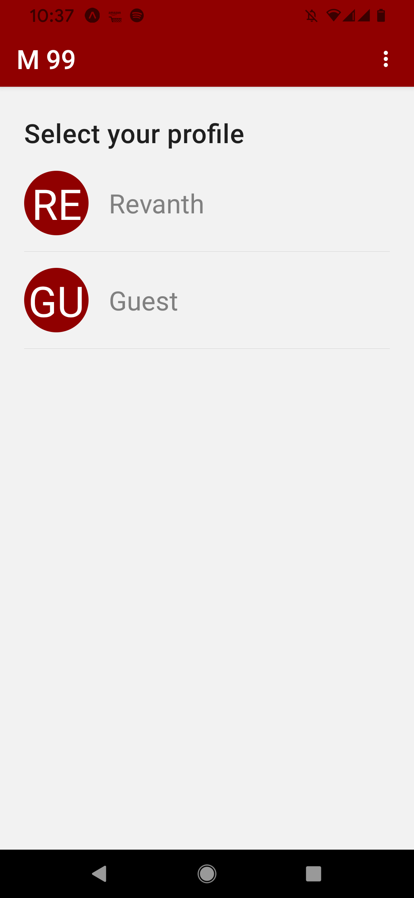
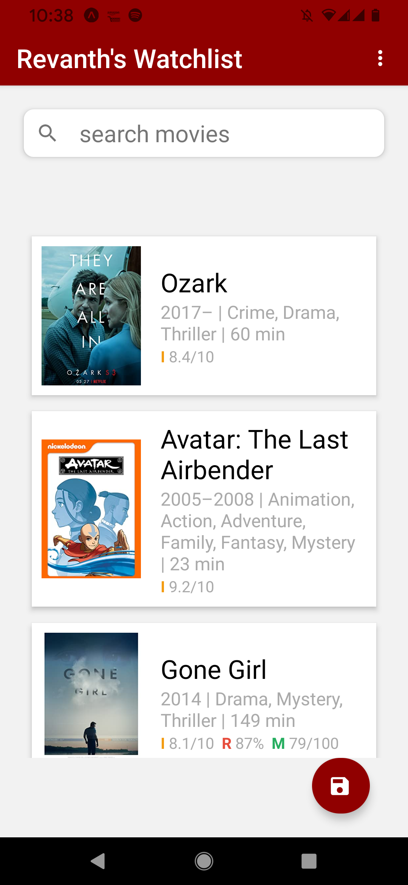
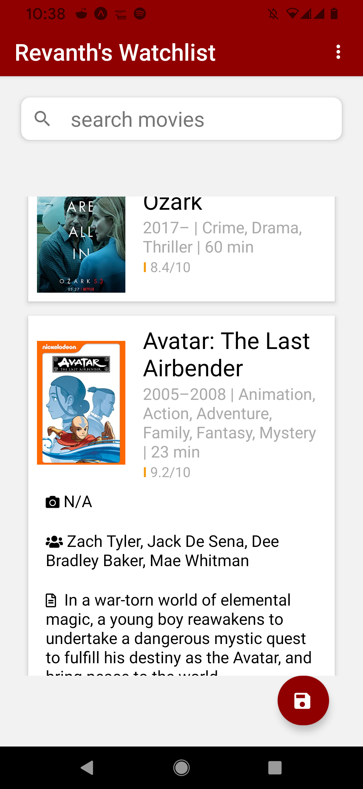
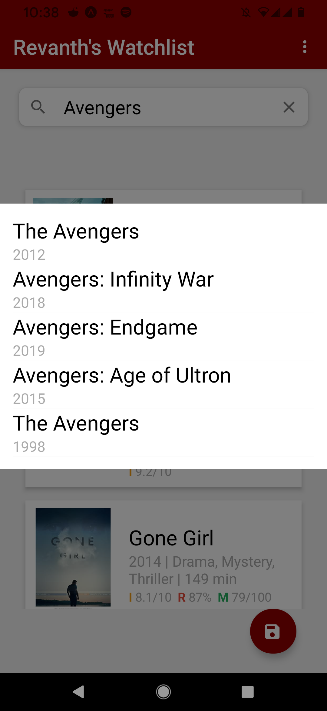

# mapp
### The Android App for [movies99.netlfiy.app](https://mapp.netlify.app)

#### features:
1. search for movies in the entire history
2. add the movie
3. save to cloud, enabling it to view Universally.

#### Technology
1. react native/REDUX/Reactnavigations/ReactPaper
2. NodeJs/ExpressJs/MongoDb/POSTMAN/AWS EC2 (Backend) /REST API/ (url: https://cell91.xyz/api)

# Screenshots

#APK
contact: nanirevanth45@gmail.com
